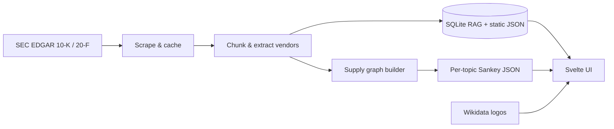

# Supply Chain Intelligence

Reverse-traced semiconductor supply chain research for AI accelerators — vendor maps, BOM estimates, and SEC filing evidence grounded in 10-K / 20-F filings.

**Author:** [Eugene Hauptmann](https://www.linkedin.com/in/eugenehp/) · **Repository:** [github.com/eugenehp/supplychain](https://github.com/eugenehp/supplychain)

---

## Overview

This project builds interactive supply-chain models for **20 research topics** (13 SEC-grounded accelerators + 7 limited-disclosure peers). Each topic traces vendors from the finished accelerator back through foundry, memory, OSAT, EDA, equipment, and materials tiers, with dollar-weighted Sankey flows and links to the underlying filing excerpts.

Data is produced by a Node.js pipeline (scrape → process → RAG index → graph → Sankey) and served by a **Svelte 5** single-page app with multiple chart views, in-browser search, filing viewer, and PDF export.



---

## Features

### Interactive supply maps

- **Sankey diagram** — tiered vendor flows with $/chip on links and company logos
- **World map** — geographic arcs between supplier jurisdictions
- **Circle pack** — nested tiers sized by spend
- **Radial tree** — product-centered supplier hierarchy
- Tier depth control (Product → Tier 5), country highlight filter, dark/light theme

### SEC-grounded research

- **Filing evidence panel** — BM25 + optional semantic search over extracted excerpts
- **Filing viewer** — full 10-K / 20-F text with section navigation
- **Sources & abbreviations** — methodology, watchlist tickers, glossary from corpus
- **Query panel** — keyword and hybrid search across ~9k document chunks (in-browser worker)

### Cross-topic analysis

- **Similarity section** — pairwise overlap vs every other research topic
- Breakdown by country and supply category
- **Shared vendors** — logo chips with hover details (name, flag, ticker)

### Branding & export

- Company logos from **Wikidata / Wikimedia Commons** (manifest-driven, predownload with `npm run logos`)
- **PDF export** — vector chart + site logo, watermarks, author LinkedIn credit, GitHub link on “Supply Chain Intelligence”

---

## Research topics

| Status | Count | Examples |
|--------|------:|----------|
| **Active** (full SEC BOM) | 13 | Nvidia H200/B200, AMD MI325X/MI350X, Intel Gaudi 3, AWS Trainium 2/3, Google TPU v5p/v6, Microsoft Maia 100/200, Meta MTIA v2 |
| **Limited** (peer topology, sparse chip-level SEC detail) | 7 | Huawei Ascend 910C, Baidu Kunlun 2, SambaNova SN40, Groq LPU, Cerebras WSE-3, Tenstorrent Blackhole, AWS Inferentia 2 |

Topics are registered in `scripts/lib/topics/index.mjs` and exported to `data/topics/index.json` when the pipeline runs.

### SEC watchlist

The pipeline scrapes and indexes filings for all tickers referenced across topics (e.g. NVDA, AMD, INTC, AMZN, MSFT, GOOGL, META, TSM, ASML, AMAT, LRCX, KLAC, SNPS, CDNS, MU, AMKR, GFS, BIDU — **18 tickers**). Verify coverage:

```bash
node scripts/verify-sec-filings.mjs
```

---

## Tier model

Supply chains use a **6-column tier model** (Product + Tiers 1–5):

| Tier | Role | Examples |
|------|------|----------|
| **Product** | Finished accelerator | Nvidia H200 |
| **Tier 1** | Direct suppliers | TSMC, SK Hynix, Fabrinet, Amkor |
| **Tier 2** | Fab equipment & materials | ASML, Ibiden, Linde |
| **Tier 3** | Equipment sub-components | Zeiss, Cymer, VAT Group |
| **Tier 4** | Raw materials | Schott, Hoya, Pfeiffer Vacuum |
| **Tier 5** | Commodity / other | (topic-specific) |

Link weights represent **estimated $/chip BOM share**, calibrated from SEC supplier disclosures and industry structure — not reported invoice data.

---

## Quick start

**Requirements:** Node.js 20+ (native modules: `better-sqlite3`)

```bash
git clone https://github.com/eugenehp/supplychain.git
cd supplychain
npm install
```

### Run the UI (uses cached pipeline data)

```bash
npm run dev
```

Open [http://localhost:5173](http://localhost:5173). Use the **Research topic** selector in the header to switch accelerators.

`predev` / `prebuild` automatically run the pipeline with `--skip-scrape --skip-embed` so the app builds from existing data without re-scraping SEC.

### Full data refresh

```bash
npm run pipeline              # scrape SEC → process → RAG → graphs → static export
npm run pipeline -- --skip-scrape   # reuse raw filings, rebuild everything else
npm run pipeline -- --skip-embed    # skip neural embedding rebuild (faster)
npm run pipeline -- --query="TSMC HBM"   # ad-hoc RAG query, then exit
```

### Production build

```bash
npm run build
npm run preview
```

Output goes to `dist/` (SEC filings, RAG JSON, logos, and topic data copied/served from `static/`).

---

## npm scripts

| Command | Description |
|---------|-------------|
| `npm run dev` | Vite dev server (runs lightweight pipeline first) |
| `npm run build` | Production build to `dist/` |
| `npm run preview` | Serve production build locally |
| `npm run pipeline` | Full scrape → process → validate → RAG → Sankey for all topics |
| `npm run scrape` | Alias for `pipeline` |
| `npm run query -- "TSMC Hynix"` | CLI RAG search against SQLite index |
| `npm run rag:server` | HTTP API on port 3001 for live filing search |
| `npm run logos` | Predownload company logos to `static/logos/` |
| `npm run glossary` | Export abbreviation glossary from RAG corpus |
| `npm run test:search` | Smoke-test search index |
| `npm run benchmark:ui` | UI performance benchmark |

---

## Pipeline stages

| Stage | What it does |
|-------|----------------|
| **1. Scrape** | Fetch latest 10-K / 20-F HTML from SEC EDGAR into `data/raw/sec/{TICKER}/` |
| **2. Process** | Strip HTML, split sections, chunk text, extract vendor entities → `data/processed/sec/` |
| **3. Validate** | Schema checks on raw and processed filings |
| **4. RAG index** | SQLite FTS5 + optional embeddings in `data/rag/index.sqlite` |
| **2b–2d. Static export** | Browser-ready SEC bundles → `static/sec/`, RAG chunks → `static/rag/` |
| **5–6. Topics** | Per-topic supply graph + Sankey JSON → `data/topics/{id}/` |
| **Report** | `data/reports/pipeline-report.json` — exit code 1 if validation fails |

Logo URLs are resolved from `data/logos/manifest.json` (Wikidata P154 → Wikimedia Commons) during static export.

---

## Project structure

```
supply_chain/
├── src/                          # Svelte 5 UI
│   ├── App.svelte                # Header, footer, topic routing
│   └── lib/
│       ├── TopicView.svelte      # Main research page sections
│       ├── SankeyChart.svelte    # D3 Sankey + vendor logos
│       ├── SupplyMapChart.svelte # World map flows
│       ├── TopicSimilarityPanel.svelte
│       ├── QueryPanel.svelte     # In-browser RAG worker
│       ├── FilingViewer.svelte
│       ├── chart-export*.js      # PDF export (worker + svg2pdf)
│       └── logo-resolver*.js     # Unified logo manifest resolver
├── scripts/
│   ├── pipeline.mjs              # Orchestrator
│   ├── fetch-logos.mjs
│   ├── verify-sec-filings.mjs
│   ├── rag-server.mjs
│   └── lib/                      # Scraper, processor, RAG, graph, topics
├── data/
│   ├── raw/sec/                  # Cached EDGAR HTML
│   ├── processed/sec/            # Chunks, sections, vendors
│   ├── rag/index.sqlite          # Server-side RAG (CLI / rag-server)
│   ├── topics/                   # Per-topic Sankey + graph JSON
│   │   └── index.json            # Topic catalog for UI
│   └── logos/manifest.json       # Logo slug → ext / source
├── static/                       # Vite public dir (served at /)
│   ├── sec/                      # Exported filing bundles
│   ├── rag/                      # chunks.json, vendors.json, glossary
│   └── logos/                    # SVG/PNG company logos
└── dist/                         # Production build output
```

---

## Adding a research topic

1. **Register** in `scripts/lib/topics/index.mjs`:

   ```js
   {
     id: 'my-accelerator',
     label: 'My Accelerator',
     status: 'active',
     productNode: 'My Accelerator',
     anchorTicker: 'TICKER',
     secWatchlist: ['TICKER', 'TSM', 'ASML', /* … */],
     // …
   }
   ```

2. **Create** `scripts/lib/topics/my-accelerator.mjs` with:
   - `NODE_META` — vendors, tiers, groups, countries
   - `SEC_SUPPLY_ROLES` — supply links and spend weights
   - `PRODUCT_NODE`, `MATERIALS_ALLOWLIST`

3. **Register module** in `scripts/lib/topics/registry.mjs` and `TOPIC_MODULES` in `scripts/lib/build-sankey.mjs`.

4. **Run** `npm run pipeline` — writes `data/topics/my-accelerator/supply-chain.json` and updates `data/topics/index.json`.

5. The UI picks up new topics automatically via `import.meta.glob` on topic JSON files.

---

## UI sections

Each topic page includes:

| Section | Description |
|---------|-------------|
| **Overview** | BOM summary, anchor company flag/logo, tier legend |
| **Search** | BM25 / semantic query over filing corpus |
| **Supply map** | Sankey, world map, circle pack, or radial tree |
| **Evidence** | SEC excerpts tied to vendors and tickers |
| **Reference** | Sources, methodology, abbreviations |
| **Similarity** | Overlap vs other topics + shared vendor logos |

Sticky header (topic selector, theme toggle) and sticky footer (author credit) keep navigation visible while scrolling.

---

## Logos

Logos resolve from a single manifest (`data/logos/manifest.json`):

1. Wikidata **P154** → Wikimedia Commons SVG (preferred)
2. Legacy PNG fallback for select tickers
3. Initials badge when no asset exists

Predownload all slugs:

```bash
npm run logos
```

---

## PDF export

Chart exports include:

- Site logo (H200 PCB favicon) in the header
- Diagonal “Supply Chain” watermark + confidential topic line
- Top-right: topic title and date
- Bottom-right: © year + [author name](https://www.linkedin.com/in/eugenehp/) (LinkedIn link)
- Footer: “Generated from [Supply Chain Intelligence](https://github.com/eugenehp/supplychain) · SEC-grounded vendor map” (underlined link)

Built in a Web Worker via **svg2pdf.js** + **jsPDF**, with raster fallback on the main thread.

---

## Optional: RAG HTTP server

For development without bundling the full static RAG index, run the SQLite-backed API:

```bash
npm run rag:server
# default http://localhost:3001
```

| Endpoint | Purpose |
|----------|---------|
| `GET /api/query?q=…` | Full-text RAG search |
| `GET /api/evidence?q=…` | Evidence excerpt search |
| `GET /api/vendors?q=…` | Vendor lookup |
| `GET /api/stats` | Index statistics |

The production UI uses static JSON + a browser worker (`static/rag/chunks.json`); the server is mainly for CLI parity and debugging.

---

## Tech stack

| Layer | Tools |
|-------|--------|
| UI | Svelte 5, Vite 8, Tailwind CSS 4, bits-ui |
| Charts | D3 (sankey, hierarchy, pack, geo) |
| Search | MiniSearch, SQLite FTS5, `@xenova/transformers` (optional embeddings) |
| PDF | jsPDF, svg2pdf.js, IBM Plex Sans |
| Pipeline | Node.js, better-sqlite3, custom SEC scraper |

---

## Disclaimer

BOM figures and vendor graphs are **research estimates** derived from public SEC filings and structured supply-chain modeling. They do not represent official company disclosures, audited financials, or real-time procurement data. Limited-disclosure topics are labeled accordingly in the UI.

---

## License

**Free for non-commercial use.** See [LICENSE](LICENSE) for full terms.

Commercial use (paid products, services, or revenue-generating deployments) requires prior written permission from [Eugene Hauptmann](https://www.linkedin.com/in/eugenehp/).

© Eugene Hauptmann
